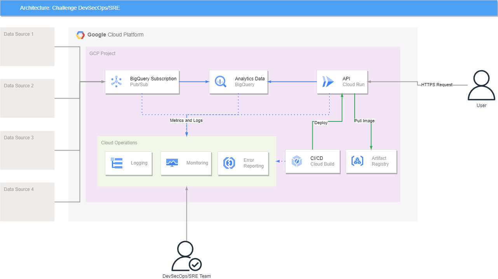

# Challenge DevSecOps/SRE

This repository contains all the code and informations about the Challenge DevSecOps/SRE.

## Objective

Develop a cloud system for ingesting, storing, and exposing data by using IaC and deployment with CI/CD. Perform quality testing, monitoring, and alerts to
ensure and monitor the health of the system.

## Infraestructure and IaC

In order to meet the requirements of the challenge, the following GCP services were used:

- [BigQuery](https://cloud.google.com/bigquery/docs): service used to store the analytics data. BigQuery is a Serverless enterprise data warehouse that serves well the porpose of storing analytics data.
- [Google Cloud Pub/Sub](https://cloud.google.com/pubsub/docs/create-bigquery-subscription): GCP service used to ingest data to BigQuery, delivering the messages sended to the BigQuery Subscription. 
- [Cloud Run](https://cloud.google.com/run/docs/overview/what-is-cloud-run): GCP container as a service product used to host the Python API.
- [Cloud Build](https://cloud.google.com/build/docs/overview): GCP service to create a run CI/CD pipelines, doing the process of testing, building and deployment of the application.
- [Artifact Registry](https://cloud.google.com/artifact-registry/docs/overview): GCP service used to store all the container images created during the CI/CD pipeline.

All the components of the solution was deployed using Terraform. The Terraform code can be found in the directory [terraform](src/terraform/).

## Application and CI/CD

The application was developed using the programming language Python and the framework FastAPI to create the API. The API documentation can be found at https://run-challenge-api-h5xyaztceq-rj.a.run.app/docs

The CI/CD was built using a Cloud Build trigger, that triggers on each event on the main branch and perform the following steps:
1. Initial setup
2. Container Image build
3. Push of the container image to Artifact Registry
4. Deploy image to Cloud Run
4. Integration test

The steps definition can be found at [cloudbuild.yaml](src/api/cloudbuild.yaml).

It was used the BigQuery subscription from GCP Pub/Sub to ingest data in the BigQuery dataset/table, on each message that reachs the topic. The BigQuery subscription was configured to use the BQ Table schema. [Link to documentation](https://cloud.google.com/pubsub/docs/create-bigquery-subscription#use-table-schema).

## Critical Quality Points

Possible critical quality points of the system:

- Latency: 
    - Deploy the application in a region that is close to the users
    - Use an GCP Global HTTP L7 Load Balancer, to balance and route the request to the closest backend
    - Use a CDN to cache the contents
- Availability:
    - Deploy the application in multi-zones or multi-regions
    - Store data in multi-zones or multi-regions
- Query performance: 
    - Otimize the query performed to reduce the response time
- Scalability
    - Deploy the application with auto-scale settings, using metrics like CPU, memory and requests over time with a appropriate threshold.

## Metrics and Monitoring

Bellow are some metrics that can help to understand the health and performance of the system:

* Response Latency
* Availability
* Query execution time
* Request and Response rate
* Error rate

To help visualizing this metrics, we can use the GCP Monitoring that is fully integrated with the Google services, and collect and show several metrics by default, with no need of further configurations. Using the Cloud Monitoring, we can create dashboards to view the metrics that we need to monitor.

As a example of dashboard with the metrics:
- A chart showing the request rate over time
- A chart showing the type of reponse over time (2xx,3xx,4xx,4xx)
- A chart showing the latency over time
- A chart showing the resource usage over time, for CPU, RAM and Disk
- A chart showing the ack and unacked messages from Pub/Sub

## Alerts and SRE

Bellow is a list with some alerts that can help the SRE team to act:

- Alert if the latency of the system is to high (400ms) during the interval of 10 minutes
- Alert if the success rate is bellow 90% of the requests during the interval of 10 minutes
- Alert if the resquest rate is above 1,000 in a minute

List of SLIs:

- Availability
- Latency: 95% of the requests during the interval of 10 minutes need to be less than 400ms
- Error rate: 5% of request error during the interval of 30 minutes

List of SLOs:
- Availability: 99% in the last 30 days
- Latency: 98% of the requests need to be less than 450ms in the last 30 days
- Error rate: 95% of the requests need to be successful in the last 30 days

## Security improvements

So that evaluators can access the URL of the API that was developed, I chose to leave the API configured in such a way that it accepts any requests without the need to perform authentication, pass a key/token or have its IP on an enabled list.

As a good practice and system improvement, we can use [Cloud Run's native functionality to require authentication](https://cloud.google.com/run/docs/authenticating/overview). Through this functionality, only service accounts or users who have permission on the service will be able to make requests.

Beside that, it's possible to implement others services and good practices to improve the security, such as:

* Apply a [Cloud Armor](https://cloud.google.com/armor/docs/cloud-armor-overview) security policy and rules with rate limiting and OWASP Top 10
* Use dedicated service accounts for each service, applying the least privilege principle
* Whenever is possible, use only internal traffic and reduce the services exposure.

## Documentation

1. [Terraform](docs/terraform.md)
2. [API](docs/api.md)